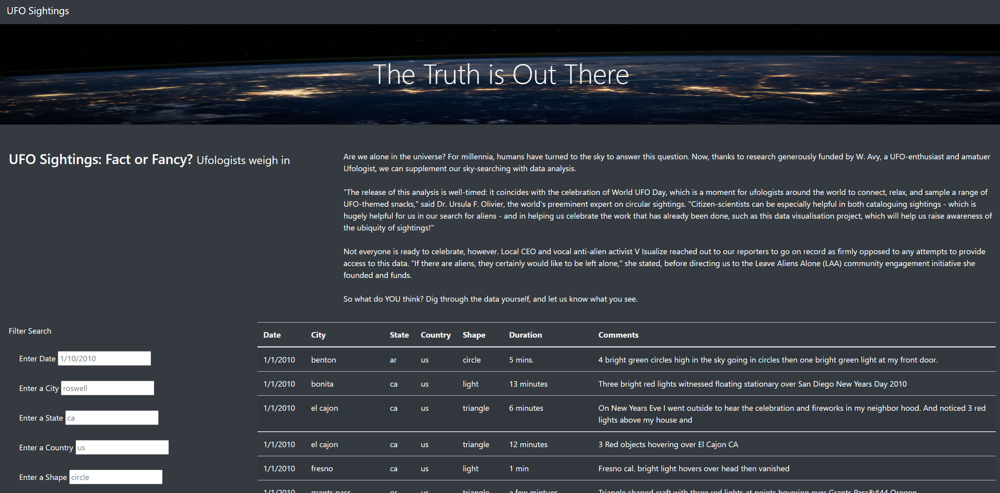
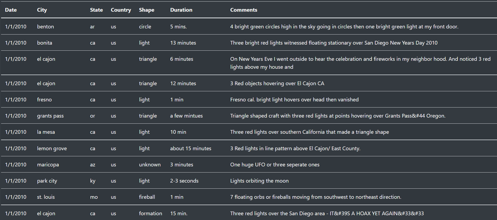
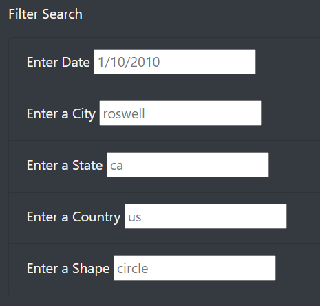
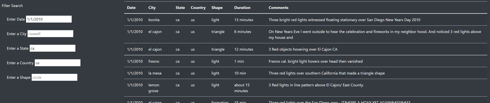

# UFOs Analysis

## Overview
The purpose of this project was to create a filtered table for my client to add more functionality to her website on UFO sightings. The website will be used as a central hub for all accounts involving Unidentified Flying Objects (UFOs). The website can be accessed and used for people who would like to search for different sightings. The added functionality of a search allows for users to find results on a small set of search criteria.

## Results
Here is the main page.

The layout of the webpage pulls from the Bootstrap grid system, which helps organize the content of the webpage into different sections. By using it, we get an effortlessly laid out website that looks clean.

The webpage shows all the information in a table using HTML tables to create a dynamic table. It pulls the content automatically from the data.js file, which contains the basic information to populate the table.

The information is displayed in the respective table header elements, which can be used to help filter the information. The filter menu on the left shows that this data can be filtered by Date, City, State, Country, and Shape. The user can simply put in the data in the textbox provided. Once they click away or press enter, the javascript file called 'app.js' automatically detects the update using D3. This update then triggers the codeline for filtering. The filter is saved and updated as the user puts in information. That way, it will add on the various filters and even updates the filter if it already exists.

Here is an example of results.

## Analysis
This is a quickly developed webpage that is highly functional in fulfilling its purpose. However, the webpage is not entirely perfect. Currently, the entire library of information is displayed in the landing page. This is fine, but can definitely be improved upon to show the information in pages. This wil shorten the webpage and possibly give a better feel to the user who is clicking through. The pages are not seperate webpages, but rather different pages in the table itself. Second, the elements inside of the filter search doesn't really work well with different window sizes. If I were to access this on a phone or smaller tablet, the experience might not be as smooth. I think further dynamic changes can be made in the CSS file to make this page more user friendly.
